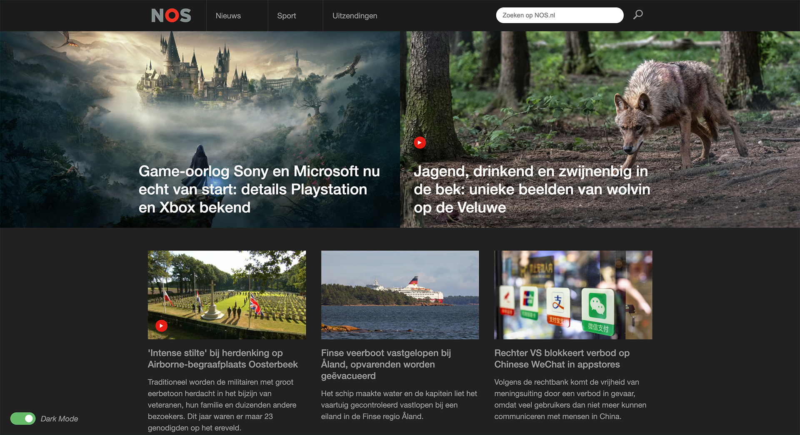
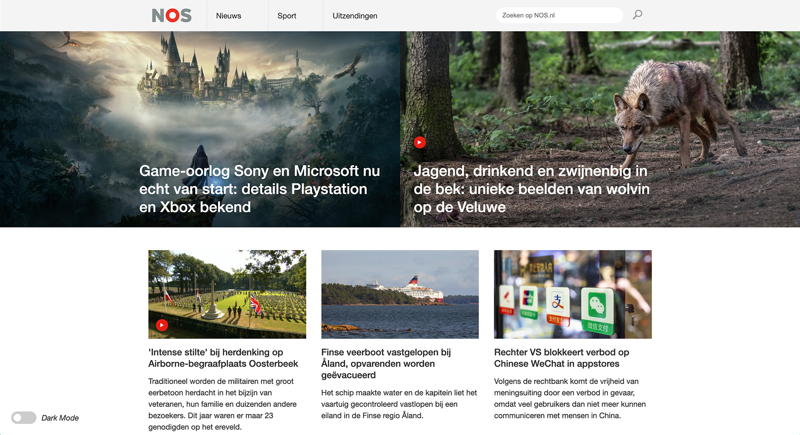

# Procesverslag
**Auteur:** Maarten Beek

Markdown cheat cheet: [Hulp bij het schrijven van Markdown](https://github.com/adam-p/markdown-here/wiki/Markdown-Cheatsheet). Nb. de standaardstructuur en de spartaanse opmaak zijn helemaal prima. Het gaat om de inhoud van je procesverslag. Besteedt de tijd voor pracht en praal aan je website.

## Bronnenlijst
1. https://nos.nl/
2. https://webdevetc.com/blog/how-to-add-a-gradient-overlay-to-a-background-image-using-just-css-and-html
3. https://codepen.io/maartenbeek/pen/jOqXOmR
4. https://dev.to/ananyaneogi/create-a-dark-light-mode-switch-with-css-variables-34l8
5. https://developer.mozilla.org/en-US/docs/Web/CSS/--*

## Eindgesprek (week 7/8)

* Variabelen toevoegen aan mijn CSS ging goed. Heb er vervolgens aan de hand van een goede bron een darkmodus aan kunnen koppelen. 

* Heb de states van de nav elementen verbeterd.

**Screenshot(s):**

## Voortgang 3 (week 6)

* Er moeten nog een aantal states worden toegevoegd.
* Na dit gesprek variabelen voor kleuren toegevoegd aan mijn CSS, om hiermee een darkmode te maken.
* Darkmode is gelukt om te maken. Heb een goede bron gevonden die werkte met css variables.
* Heb mijn kleuren systeem behoorlijk moeten ombouwen naar variables, maar het werkt nu goed met darkmode en het is overzichtelijker.

## Voortgang 2 (week 5)

* Mijn website zag er goed uit.

* Nog wel kijken naar de hoeveelheid classes die (overbodig) worden gebruikt.

## Voortgang 1 (week 3)

### Stand van zaken

* Flexbox en positioning gingen beide goed. Met flexbox heb ik nog wel even moeten klooien maar het kwam vrij snel goed.

* Ik heb al eens stukje javascript gebruikt. Deze werkt in principe maar er zat een bug in mijn HTML die nu verholpen is. 

**Screenshot(s):**

### Agenda voor meeting

* Hoe zit het met javascript gebruik voor andere elementen dan je micro interactie. Zoals slideshows en dergelijken. Moeten deze met javascript uitgewerkt worden?

### Verslag van meeting

-na afloop snel uitkomsten vastleggen-

## Intake (week 1)

**Je startniveau:** Rood

**Je focus:** Surface plane

**Je opdracht:** nos.nl

Ik heb de website van nos gekozen omdat:

* Ik hier mogelijkheden zie om met flexbox te werken en aangezien ik daar nooit echt mee gewerkt heb leek me dit een leuke uitdaging.

* Er een aantal javascript uitdagingen in zitten zoals image en video sliders.

* Ik de zoekfunctie heel saai vind en daar een vette micro interactie van wil maken.

**Screenshot(s):**

**Breakdown-schets(en):**

